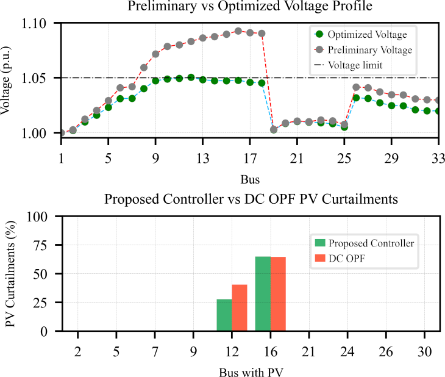
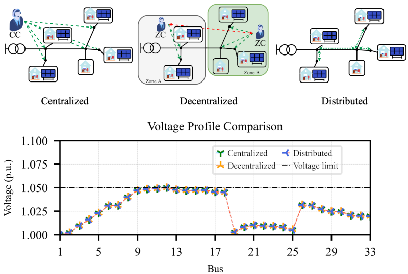
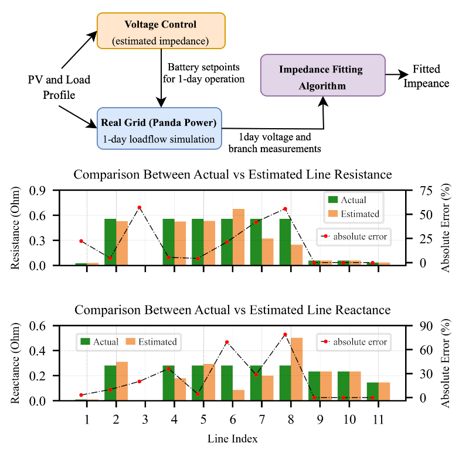
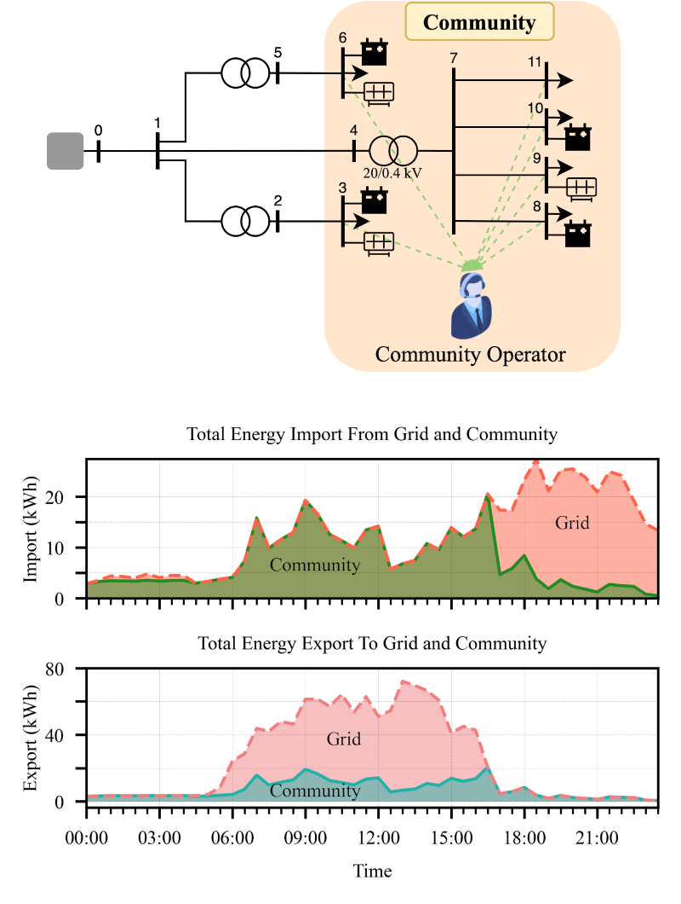

# Research Highlights
---

### Hi 👋

  
  

This page contains some insight of my current research projects as a power system researcher. The projects are presented in the form of iPython Notebooks. You can access them by clicking    

 

## 1) Multi-Objective Optimal Power Flow (OPF) for Radial Distribution Grid

This project focuses on operational planning for distribution grid / microgrid with high peneteration of distributed energy resources, such as PV system. In particular, I developed a controller that formulated as multi-objective optimal power flow (OPF) (optimization problem) with <b>convex relaxation</b> The main objective of the proposed controller is to compute the optimal techno-economic operation of the grid, which then can be utilized by distribution system operator (DSO) or microgrid operator.
  

Furthermore, a sensitivity analysis is also presented, which show how selection of controller parameters can impact the operating region of the controller. In terms of performance, the proposed controller shows having a very-high accuracy compared to traditional OPF techniques such as linear/DC OPF.
  

**Related publication:** 
1) **M. A. Putratama**, R. Rigo-Mariani, V. Debusschere and Y. Besanger, "_Parameter Tuning for LV Centralized and Distributed Voltage Control with High PV Production_," 2021 IEEE Madrid PowerTech, 2021, pp. 1-6. ([Link to publication](https://doi.org/10.1109/PowerTech46648.2021.9494802)).

---

## 2) Centralized, Decentralized and Distributed Control Architectures for Distribution Grid

The objective of this project is to transform the centralized controller that has been developed in the previous project into <b>distributed</b> / <b>peer-to-peer (P2P)</b> and <b>decentralized</b> architecture. Some benefits moving towards distributed architecture are: 

1. More robust controller
2. Increase scalability
3. Computational sharing
4. Limit information sharing (preserve prosumers' privacy)

Therefore in this project, I developed a **distribution algorithm** that can solve a centralized optimization problem into distributed and decentralized problem, allowing transformation of the proposed centralized controller introduced in the previous project into distribtued and decentralized controller.  

**Related publications:** 
- **M. A. Putratama**, R. Rigo-Mariani, V. Debusschere and Y. Besanger, "_Parameter Tuning for LV Centralized and Distributed Voltage Control with High PV Production_," 2021 IEEE Madrid PowerTech, 2021, pp. 1-6. ([Link to publication](https://doi.org/10.1109/PowerTech46648.2021.9494802)).

- One article is still under publication process.

---

## 3) Grid Impedance Estimation using Model Fitting

Most of power system projects require grid data in order to properly identify and solve the problems/to work on the projects. However in real life, grid data is usually unavailable, especially for low-voltage networks. 
  

In this project, I developed a model fitting alogrithm to estimate grid data (line impedance values) using historic measurment data. The proposed algorithm can effectively improve the accuracy of the estimated data. The proposed algorithm then can be utilized in many projects, for instance power system planning studies,  controller developments, local energy market management and any other projects that require grid data.  

**Related publication:** One article is still under publication process.

---

## 4) Market Strategy for Energy Community

The growth of prosumers owned DERs has been continously increasing. This phenomenon then opens up new opportunities for prosumers to participate in local energy markets. Local energy markets enable prosumers to trade their local production to another prosumer. As a result, prosumer can benefit for cheaper electricity price.
  

This work in particular, I focus on energy community, where prosumers are group together to form a community that can trade and exchange energy within each other. To that end, I developed a market strategy for an energy community that can ensure prosumers cost reduction while maintaining the grid operation within its technical constraints. In the simulation, the proposed strategy shows an average of 20% prosumers cost reduction and any voltage violation in the real-time operation can be mitigated.  

**Related publication:** One article is still under publication process, now currently on the second round of review.
